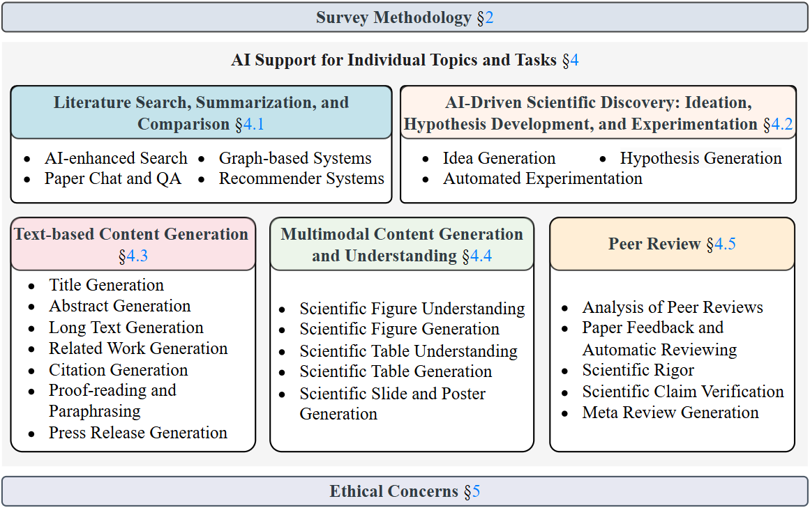

# Transforming Science with Large Language Models

[](https://arxiv.org/pdf/2502.05151)
[](https://opensource.org/licenses/MIT)
[]()
[]()

Welcome to the **Transforming Science with Large Language Models** repository! 
This repository is a collection of the most influential papers, AI models, and tools to empower researchers and academics worldwide to conduct their research more efficiently and effectively.

<!-- omit in toc -->
## 👥 Authors

#### [Steffen Eger](steffen.eger@utn.de), [Yong Cao](yong.cao@uni-tuebingen.de), [Jennifer D'Souza](jennifer.dsouza@tib.eu), [Andreas Geiger](a.geiger@uni-tuebingen.de), [Christian Greisinger](christian.greisinger@utn.de), [Stephanie Gross](stephanie.gross@ofai.at), [Yufang Hou](yufang.hou@it-u.at), [Brigitte Krenn](brigitte.krenn@ofai.at), [Anne Lauscher](anne.lauscher@uni-hamburg.de), [Yizhi Li](yizhi.li-2@manchester.ac.uk), [Chenghua Lin](chenghua.lin@manchester.ac.uk), [Nafise Sadat Moosavi](n.s.moosavi@sheffield.ac.uk), [Wei Zhao](wei.zhao@abdn.ac.uk), and [Tristan Miller](Tristan.Miller@umanitoba.ca)

<!-- omit in toc -->
## 📢 Updates

- **2024-01**: Our conference paper, **[AutomaTikZ: Text-Guided Synthesis of Scientific Vector Graphics with TikZ](https://openreview.net/forum?id=v3K5TVP8kZ)** has been accepted at 
- **2024-09**: Our conference paper, **[DeTikZify: Synthesizing Graphics Programs for Scientific Figures and Sketches with TikZ](https://openreview.net/forum?id=bcVLFQCOjc)** has been accepted at  as a <span style='color: red;'>Spotlight Paper</span>
- **2025-01**: Our conference paper, **[ScImage: How Good Are Multimodal Large Language Models at Scientific Text-to-Image Generation?](https://openreview.net/forum?id=ugyqNEOjoU)** has been accepted at 
- **2025-02**: Our survey paper, **[Transforming Science with Large Language Models](https://arxiv.org/abs/2502.05151)**, is now available on 

<!-- omit in toc -->
## 👀 Introduction

Science is undergoing a transformation with AI-driven tools assisting researchers at every stage of the research cycle.



Our survey provides a comprehensive overview of LLMs role in scientific workflows, structured around five key areas: search and summarization, experimentation, unimodal and multimodal content generation, and peer review.

For a detailed introduction, please refer to [our survey paper](https://arxiv.org/abs/2502.05151).

<!-- omit in toc -->
## 📌 Table of Contents

- [🔍 Literature Search, Summarization, and Comparison](#literature-search-summarization-and-comparison)
    - [AI-Enhanced Search](#ai-enhanced-search)
    - [Graph-Based](#graph-based)
    - [Paper Chat](#paper-chat)
    - [Recommender](#recommender)
    - [Search Engines](#search-engines)
    - [Benchmarks](#benchmarks)
- [💡 AI-Driven Scientific Discovery: Ideation, Hypothesis Generation, and Experimentation](#ai-driven-scientific-discovery-ideation-hypothesis-generation-and-experimentation)
    - [Idea Generation](#idea-generation)
    - [Hypothesis Generation](#hypothesis-generation)
    - [Automated Experimentation](#automated-experimentation)
- [📝 Text-based Content Generation](#text-based-content-generation)
    - [Title](#title)
    - [Abstract](#abstract)
    - [Related Work](#related-work)
    - [Citation](#citation)
    - [Long Text](#long-text)
    - [Proof-Reading and Paraphrasing](#proof-reading-and-paraphrasing)
    - [Press Release](#press-release)
- [🎨 Multimodal Content Generation and Understanding](#multimodal-content-generation-and-understanding)
    - [Scientific Figure Understanding](#scientific-figure-understanding)
    - [Scientific Figure Generation](#scientific-figure-generation)
    - [Scientific Table Understanding](#scientific-table-understanding)
    - [Scientific Table Generation](#scientific-table-generation)
    - [Scientific Slides and Poster Generation](#scientific-slides-and-poster-generation)
- [✅ Peer Review](#peer-review)
    - [Analysis of Peer Reviews](#analysis-of-peer-reviews)
    - [Paper Feedback and Automatic Reviewing](#paper-feedback-and-automatic-reviewing)
    - [Scientific Rigor](#scientific-rigour)
    - [Scientific Claim Verification](#scientific-claim-verification)
    - [Meta Review Generation](#meta-review-generation)
- [🚀 End-to-End](#end-to-end)

# 🔍 Literature Search, Summarization, and Comparison

## AI-Enhanced Search
| Platform | Search | Reco-mmen-dations | Collec-tions | Citation Analysis | Trending Analysis | Author Profiles | Visual-ization Tools | Paper Chat | Idea Gener-ation | Paper Writing | Summa-rization | Paper Review | Data-sets | Code Reposi-tories | LLM Inte-gration | Web API | Personal-ization | Free |
|-|-|-|-|-|-|-|-|-|-|-|-|-|-|-|-|-|-|-|
| [**Elicit**](https://elicit.com/) | ✔️ | ❌ | ❌ | ❌ | ❌ | ❌ | ❌ | ✔️ | ✔️ | ❌ | ✔️ | ✔️ | ❌ | ❌ | ✔️ | ❌ | ❌ | ✔️❌ |
| [**OpenSholar**](https://openscilm.allen.ai/) | ✔️ | ❌ | ✔️ | ❌ | ❌ | ❌ | ❌ | ✔️ | ❌ | ❌ | ✔️ | ❌ | ❌ | ❌ | ✔️ | ❌ | ❌ | ✔️ |
| [**Undermind**](https://www.undermind.ai/) | ✔️ | ❌ | ✔️ | ❌ | ❌ | ❌ | ❌ | ✔️ | ❌ | ❌ | ✔️ | ❌ | ❌ | ❌ | ✔️ | ❌ | ✔️ | ❌ |
| [**Perplexity**](https://www.perplexity.ai/) | ✔️ | ❌ | ❌ | ❌ | ❌ | ❌ | ❌ | ✔️ | ✔️ | ❌ | ✔️ | ✔️ | ❌ | ❌ | ✔️ | ❌ | ❌ | ✔️❌ |
| [**Consensus**](https://consensus.app/) | ✔️ | ❌ | ✔️ | ❌ | ❌ | ❌ | ❌ | ✔️ | ❌ | ❌ | ✔️ | ❌ | ❌ | ❌ | ✔️ | ✔️ | ❌ | ✔️❌ |
| [**SciSpace**](https://scispace.com/) | ✔️ | ❌ | ✔️ | ❌ | ❌ | ❌ | ❌ | ✔️ | ✔️ | ❌ | ✔️ | ✔️ | ❌ | ❌ | ✔️ | ❌ | ❌ | ✔️❌ |
| [**scienceQA**](https://www.scienceos.ai/) | ✔️ | ❌ | ✔️ | ✔️ | ❌ | ❌ | ❌ | ✔️ | ✔️ | ❌ | ✔️ | ✔️ | ❌ | ❌ | ✔️ | ❌ | ❌ | ✔️❌ |
| [**PaperQA2**](https://github.com/Future-House/paper-qa) | ❌ | ❌ | ❌ | ❌ | ❌ | ❌ | ❌ | ✔️ | ❌ | ❌ | ❌ | ❌ | ❌ | ✔️ | ✔️ | ❌ | ❌ | ✔️ |
| [**Paperguide**](https://paperguide.ai/) | ✔️ | ❌ | ✔️ | ❌ | ❌ | ❌ | ❌ | ✔️ | ✔️ | ❌ | ✔️ | ✔️ | ❌ | ❌ | ✔️ | ❌ | ❌ | ✔️❌ |
| [**HyperWrite**](https://www.hyperwriteai.com/) | ✔️ | ❌ | ❌ | ❌ | ❌ | ❌ | ❌ | ✔️ | ✔️ | ✔️ | ✔️ | ✔️ | ❌ | ❌ | ✔️ | ❌ | ❌ | ❌ |
| [**ResearchKick**](https://www.researchkick.com/) | ✔️ | ❌ | ❌ | ❌ | ❌ | ❌ | ❌ | ✔️ | ✔️ | ✔️ | ✔️ | ✔️ | ❌ | ❌ | ✔️ | ❌ | ✔️ | ❌ |

## Graph-Based
| Platform | Search | Reco-mmen-dations | Collec-tions | Citation Analysis | Trending Analysis | Author Profiles | Visual-ization Tools | Paper Chat | Idea Gener-ation | Paper Writing | Summa-rization | Paper Review | Data-sets | Code Reposi-tories | LLM Inte-gration | Web API | Personal-ization | Free |
|-|-|-|-|-|-|-|-|-|-|-|-|-|-|-|-|-|-|-|
| [**Connected Papers**](https://www.connectedpapers.com/) | ✔️ | ❌ | ✔️ | ❌ | ❌ | ❌ | ✔️ | ❌ | ❌ | ❌ | ❌ | ❌ | ❌ | ❌ | ❌ | ❌ | ❌ | ✔️❌ |
| [**ScholarGPS**](https://scholargps.com/) | ✔️ | ❌ | ❌ | ✔️ | ✔️ | ✔️ | ✔️ | ❌ | ❌ | ❌ | ❌ | ❌ | ❌ | ❌ | ❌ | ❌ | ❌ | ✔️ |
| [**CiteSpace**](https://citespace.podia.com/) | ❌ | ❌ | ❌ | ❌ | ✔️ | ❌ | ✔️ | ❌ | ❌ | ❌ | ❌ | ❌ | ❌ | ❌ | ❌ | ❌ | ❌ | ✔️❌ |
| [**Sci2**](https://sci2.cns.iu.edu/) | ❌ | ❌ | ❌ | ❌ | ❌ | ❌ | ✔️ | ❌ | ❌ | ❌ | ❌ | ❌ | ❌ | ❌ | ❌ | ❌ | ❌ | ✔️ |
| [**NLP KG**](https://nlpkg.sebis.cit.tum.de/) | ✔️ | ❌ | ✔️ | ✔️ | ❌ | ✔️ | ✔️ | ❌ | ❌ | ❌ | ❌ | ❌ | ❌ | ❌ | ❌ | ❌ | ❌ | ✔️ |
| [**ORKG ASK**](https://ask.orkg.org/) | ✔️ | ❌ | ✔️ | ❌ | ❌ | ❌ | ❌ | ❌ | ❌ | ❌ | ✔️ | ❌ | ❌ | ❌ | ✔️ | ❌ | ❌ | ✔️ |

## Paper Chat
| Platform | Search | Reco-mmen-dations | Collec-tions | Citation Analysis | Trending Analysis | Author Profiles | Visual-ization Tools | Paper Chat | Idea Gener-ation | Paper Writing | Summa-rization | Paper Review | Data-sets | Code Reposi-tories | LLM Inte-gration | Web API | Personal-ization | Free |
|-|-|-|-|-|-|-|-|-|-|-|-|-|-|-|-|-|-|-|
| [**ChatGPT**](https://chatgpt.com/) | ✔️ | ❌ | ❌ | ❌ | ❌ | ❌ | ❌ | ✔️ | ✔️ | ✔️ | ✔️ | ✔️ | ❌ | ❌ | ✔️ | ✔️ | ❌ | ✔️❌ |
| [**Claude**](https://claude.ai/) | ✔️ | ❌ | ❌ | ❌ | ❌ | ❌ | ❌ | ✔️ | ✔️ | ✔️ | ✔️ | ✔️ | ❌ | ❌ | ✔️ | ✔️ | ❌ | ✔️❌ |
| [**Deepseek**](https://chat.deepseek.com/) | ✔️ | ❌ | ❌ | ❌ | ❌ | ❌ | ❌ | ✔️ | ✔️ | ✔️ | ✔️ | ✔️ | ❌ | ❌ | ✔️ | ✔️ | ❌ | ✔️ |
| [**Research**](https://un.ms/research) | ❌ | ❌ | ✔️ | ❌ | ❌ | ❌ | ❌ | ✔️ | ✔️ | ❌ | ✔️ | ✔️ | ❌ | ❌ | ✔️ | ❌ | ❌ | ✔️❌ |
| [**NotebookLM**](https://notebooklm.google/) | ❌ | ❌ | ❌ | ❌ | ❌ | ❌ | ❌ | ✔️ | ✔️ | ❌ | ✔️ | ✔️ | ❌ | ❌ | ✔️ | ❌ | ✔️ | ✔️❌ |
| [**EnagoRead**](https://www.read.enago.com/) | ✔️ | ❌ | ✔️ | ❌ | ❌ | ❌ | ❌ | ✔️ | ✔️ | ❌ | ✔️ | ✔️ | ❌ | ❌ | ✔️ | ❌ | ✔️ | ✔️❌ |
| [**DocAnalyzer.AI**](https://docanalyzer.ai/) | ❌ | ❌ | ✔️ | ❌ | ❌ | ❌ | ❌ | ✔️ | ✔️ | ❌ | ✔️ | ✔️ | ❌ | ❌ | ✔️ | ✔️ | ✔️ | ❌ |
| [**CoralAI**](https://www.getcoralai.com/) | ❌ | ❌ | ✔️ | ❌ | ❌ | ❌ | ❌ | ✔️ | ✔️ | ❌ | ✔️ | ✔️ | ❌ | ❌ | ✔️ | ❌ | ❌ | ✔️❌ |
| [**ExplainPaper**](https://www.explainpaper.com/) | ❌ | ❌ | ❌ | ❌ | ❌ | ❌ | ❌ | ✔️ | ✔️ | ❌ | ✔️ | ✔️ | ❌ | ❌ | ✔️ | ❌ | ❌ | ✔️❌ |
| [**ChatPDF**](https://www.chatpdf.com/) | ✔️ | ❌ | ✔️ | ❌ | ❌ | ❌ | ❌ | ✔️ | ✔️ | ❌ | ✔️ | ✔️ | ❌ | ❌ | ✔️ | ❌ | ❌ | ❌ |

## Recommender
| Platform | Search | Reco-mmen-dations | Collec-tions | Citation Analysis | Trending Analysis | Author Profiles | Visual-ization Tools | Paper Chat | Idea Gener-ation | Paper Writing | Summa-rization | Paper Review | Data-sets | Code Reposi-tories | LLM Inte-gration | Web API | Personal-ization | Free |
|-|-|-|-|-|-|-|-|-|-|-|-|-|-|-|-|-|-|-|
| [**Arxiv Sanity**](https://arxiv-sanity-lite.com/) | ✔️ | ✔️ | ✔️ | ❌ | ❌ | ❌ | ❌ | ❌ | ❌ | ❌ | ❌ | ❌ | ❌ | ❌ | ❌ | ❌ | ✔️ | ✔️ |
| [**Scholar Inbox**](https://www.scholar-inbox.com/) | ✔️ | ✔️ | ✔️ | ❌ | ✔️ | ❌ | ✔️ | ❌ | ❌ | ❌ | ❌ | ❌ | ❌ | ❌ | ✔️ | ❌ | ✔️ | ✔️ |
| [**ResearchTrend.ai**](https://researchtrend.ai/) | ✔️ | ❌ | ❌ | ❌ | ✔️ | ❌ | ❌ | ❌ | ❌ | ❌ | ❌ | ❌ | ❌ | ❌ | ❌ | ❌ | ❌ | ✔️❌ |
| [**TrendingPapers**](https://trendingpapers.com/) | ✔️ | ✔️ | ❌ | ❌ | ✔️ | ❌ | ❌ | ❌ | ❌ | ❌ | ✔️ | ❌ | ❌ | ❌ | ✔️ | ❌ | ✔️ | ✔️ |
| [**Bytez**](https://dev.bytez.com/) | ✔️ | ❌ | ❌ | ❌ | ✔️ | ❌ | ❌ | ✔️ | ✔️ | ❌ | ✔️ | ✔️ | ❌ | ❌ | ✔️ | ✔️ | ❌ | ✔️❌ |
| [**Notesum.ai**](https://notesum.ai/) | ✔️ | ✔️ | ✔️ | ❌ | ❌ | ❌ | ❌ | ❌ | ❌ | ❌ | ✔️ | ❌ | ❌ | ❌ | ✔️ | ❌ | ✔️ | ✔️❌ |
| [**Research Rabbit**](https://www.researchrabbit.ai/) | ✔️ | ❌ | ✔️ | ❌ | ❌ | ❌ | ✔️ | ❌ | ❌ | ❌ | ❌ | ❌ | ❌ | ❌ | ❌ | ❌ | ❌ | ✔️ |

## Search Engines
| Platform | Search | Reco-mmen-dations | Collec-tions | Citation Analysis | Trending Analysis | Author Profiles | Visual-ization Tools | Paper Chat | Idea Gener-ation | Paper Writing | Summa-rization | Paper Review | Data-sets | Code Reposi-tories | LLM Inte-gration | Web API | Personal-ization | Free |
|-|-|-|-|-|-|-|-|-|-|-|-|-|-|-|-|-|-|-|
| [**Google Sholar**](https://scholar.google.com/) | ✔️ | ✔️ | ✔️ | ✔️ | ❌ | ✔️ | ❌ | ❌ | ❌ | ❌ | ❌ | ❌ | ❌ | ❌ | ❌ | ❌ | ✔️ | ✔️ |
| [**Semantic Sholar**](https://www.semanticscholar.org/) | ✔️ | ✔️ | ✔️ | ✔️ | ✔️ | ✔️ | ❌ | ✔️ | ❌ | ❌ | ✔️ | ❌ | ❌ | ❌ | ✔️ | ✔️ | ✔️ | ✔️ |
| [**Baidu Sholar**](https://xueshu.baidu.com/) | ✔️ | ✔️ | ✔️ | ✔️ | ✔️ | ✔️ | ❌ | ❌ | ❌ | ❌ | ❌ | ❌ | ❌ | ❌ | ✔️ | ❌ | ✔️ | ✔️❌ |
| [**BASE**](https://www.base-search.net/) | ✔️ | ❌ | ✔️ | ❌ | ❌ | ❌ | ❌ | ❌ | ❌ | ❌ | ❌ | ❌ | ❌ | ❌ | ❌ | ✔️ | ❌ | ✔️ |
| [**Internet Archive Sholar**](https://scholar.archive.org/) | ✔️ | ❌ | ❌ | ❌ | ❌ | ❌ | ❌ | ❌ | ❌ | ❌ | ❌ | ❌ | ❌ | ❌ | ❌ | ✔️ | ❌ | ✔️ |
| [**Scilit**](https://www.scilit.com/) | ✔️ | ❌ | ✔️ | ✔️ | ❌ | ✔️ | ❌ | ❌ | ❌ | ❌ | ❌ | ❌ | ❌ | ❌ | ❌ | ❌ | ❌ | ✔️ |
| [**The Lens**](https://www.lens.org/) | ✔️ | ❌ | ✔️ | ❌ | ❌ | ✔️ | ❌ | ❌ | ❌ | ❌ | ❌ | ❌ | ❌ | ❌ | ❌ | ✔️ | ❌ | ✔️❌ |
| [**Science.gov**](https://science.gov/) | ✔️ | ❌ | ❌ | ❌ | ❌ | ❌ | ✔️ | ❌ | ❌ | ❌ | ❌ | ❌ | ❌ | ❌ | ❌ | ❌ | ❌ | ✔️ |
| [**Academia.eu**](https://www.academia.edu/) | ✔️ | ❌ | ✔️ | ❌ | ❌ | ✔️ | ❌ | ❌ | ❌ | ❌ | ❌ | ❌ | ❌ | ❌ | ❌ | ❌ | ❌ | ✔️❌ |
| [**OpenAlex**](https://openalex.org/) | ✔️ | ❌ | ❌ | ❌ | ❌ | ✔️ | ❌ | ❌ | ❌ | ❌ | ❌ | ❌ | ❌ | ❌ | ❌ | ✔️ | ❌ | ✔️❌ |
| [**AceMap**](https://acemap.info/) | ✔️ | ❌ | ❌ | ✔️ | ✔️ | ✔️ | ✔️ | ❌ | ❌ | ❌ | ❌ | ✔️ | ❌ | ❌ | ❌ | ❌ | ❌ | ✔️ |
| [**PubTator3**](https://www.ncbi.nlm.nih.gov/research/pubtator3/) | ✔️ | ❌ | ✔️ | ✔️ | ❌ | ❌ | ❌ | ❌ | ❌ | ❌ | ❌ | ❌ | ❌ | ❌ | ❌ | ✔️ | ❌ | ✔️ |

## Benchmarks
| Platform | Search | Reco-mmen-dations | Collec-tions | Citation Analysis | Trending Analysis | Author Profiles | Visual-ization Tools | Paper Chat | Idea Gener-ation | Paper Writing | Summa-rization | Paper Review | Data-sets | Code Reposi-tories | LLM Inte-gration | Web API | Personal-ization | Free |
|-|-|-|-|-|-|-|-|-|-|-|-|-|-|-|-|-|-|-|
| [**Papers with Code**](https://portal.paperswithcode.com/) | ✔️ | ❌ | ❌ | ❌ | ❌ | ❌ | ❌ | ❌ | ❌ | ❌ | ❌ | ❌ | ✔️ | ✔️ | ❌ | ❌ | ❌ | ✔️ |
| [**ScienceAgentBench**](https://github.com/OSU-NLP-Group/ScienceAgentBench) | ❌ | ❌ | ❌ | ❌ | ❌ | ❌ | ❌ | ❌ | ❌ | ❌ | ✔️ | ❌ | ✔️ | ✔️ | ✔️ | ❌ | ❌ | ✔️ |
| [**ORKG Benchmarks**](https://orkg.org/benchmarks) | ❌ | ❌ | ❌ | ❌ | ✔️ | ❌ | ✔️ | ❌ | ❌ | ❌ | ❌ | ❌ | ✔️ | ❌ | ❌ | ❌ | ❌ | ✔️ |
| [**Huggingface**](https://huggingface.co/) | ✔️ | ❌ | ✔️ | ❌ | ✔️ | ❌ | ❌ | ❌ | ❌ | ❌ | ❌ | ❌ | ✔️ | ✔️ | ❌ | ❌ | ❌ | ✔️❌ |

# 💡 AI-Driven Scientific Discovery: Ideation, Hypothesis Generation, and Experimentation

## Idea Generation
* The IDEA Challenge 2022 dataset [[Dataset]](https://research-information.bris.ac.uk/en/datasets/the-idea-challenge-2022-dataset) 
* SPACE-IDEAS: A Dataset for Salient Information Detection in Space Innovation [[Paper]](https://aclanthology.org/2024.lrec-main.1311/) 
* Nova: An Iterative Planning and Search Approach to Enhance Novelty and Diversity of LLM Generated Ideas [[Paper]](https://arxiv.org/abs/2410.14255) 
* Chain of Ideas: Revolutionizing Research Via Novel Idea Development with LLM Agents [[Paper]](https://arxiv.org/abs/2410.13185) 
* Scideator: Human-LLM Scientific Idea Generation Grounded in Research-Paper Facet Recombination [[Paper]](https://arxiv.org/abs/2409.14634) 
* Many Heads Are Better Than One: Improved Scientific Idea Generation by A LLM-Based Multi-Agent System [[Paper]](https://arxiv.org/abs/2410.09403) 

## Hypothesis Generation
* Large Language Models are Zero Shot Hypothesis Proposers [[Paper]](https://openreview.net/forum?id=EAuteBjTMw) 
* Hypothesis Generation with Large Language Models [[Paper]](https://aclanthology.org/2024.nlp4science-1.10/) 
* Exploring Scientific Hypothesis Generation with Mamba [[Paper]](https://aclanthology.org/2024.nlp4science-1.17/) 
* Large Language Models for Automated Open-domain Scientific Hypotheses Discovery [[Paper]](https://aclanthology.org/2024.findings-acl.804/) 
* Large Language Models as Biomedical Hypothesis Generators: A Comprehensive Evaluation [[Paper]](https://openreview.net/forum?id=q36rpGlG9X) 
* Improving Scientific Hypothesis Generation with Knowledge Grounded Large Language Models [[Paper]](https://arxiv.org/abs/2411.02382) 
* Towards an AI co-scientist [[Paper]](https://storage.googleapis.com/coscientist_paper/ai_coscientist.pdf) 
* MOOSE-Chem: Large Language Models for Rediscovering Unseen Chemistry Scientific Hypotheses [[Paper]](https://openreview.net/forum?id=X9OfMNNepI) 
* Literature Meets Data: A Synergistic Approach to Hypothesis Generation [[Paper]](https://arxiv.org/abs/2410.17309) 

## Automated Experimentation
* AutoML-GPT: Large Language Model for AutoML [[Paper]](https://arxiv.org/abs/2309.01125) 
* MLAgentBench: Evaluating Language Agents on Machine Learning Experimentation [[Paper]](https://arxiv.org/abs/2310.03302) 
* SWE-bench: Can Language Models Resolve Real-world Github Issues? [[Paper]](https://openreview.net/forum?id=VTF8yNQM66) 
* MLCopilot: Unleashing the Power of Large Language Models in Solving Machine Learning Tasks [[Paper]](https://aclanthology.org/2024.eacl-long.179/) 
* Automatic benchmarking of large multimodal models via iterative experiment programming [[Paper]](https://arxiv.org/abs/2406.12321) 
* Agent-as-a-Judge: Evaluate Agents with Agents [[Paper]](https://arxiv.org/abs/2410.10934) 
* ScienceAgentBench: Toward Rigorous Assessment of Language Agents for Data-Driven Scientific Discovery [[Paper]](https://arxiv.org/abs/2410.05080) 
* AutoML-Agent: A Multi-Agent LLM Framework for Full-Pipeline AutoML [[Paper]](https://arxiv.org/abs/2410.02958) 
* Tree Search for Language Model Agents [[Paper]](https://arxiv.org/abs/2407.01476) 
* SELA: Tree-Search Enhanced LLM Agents for Automated Machine Learning [[Paper]](https://arxiv.org/abs/2410.17238) 
* OpenHands: An Open Platform for AI Software Developers as Generalist Agents [[Paper]](https://arxiv.org/abs/2407.16741) 
* AI agents in chemical research: GVIM - an intelligent research assistant system [[Paper]](https://pubs.rsc.org/en/content/articlelanding/2025/dd/d4dd00398e) 
* SWE-bench Multimodal: Do AI Systems Generalize to Visual Software Domains? [[Paper]](https://openreview.net/forum?id=riTiq3i21b) 
* AIDE: AI-Driven Exploration in the Space of Code [[Paper]](https://arxiv.org/abs/2502.13138) 
* MLGym: A New Framework and Benchmark for Advancing AI Research Agents [[Paper]](https://arxiv.org/abs/2502.14499) 
* DrugAgent: Automating AI-aided Drug Discovery Programming through LLM Multi-Agent Collaboration [[Paper]](https://arxiv.org/abs/2411.15692) 

# 📝 Text-based Content Generation

## Title
* PaperRobot: Incremental Draft Generation of Scientific Ideas [[Paper]](https://aclanthology.org/P19-1191/) 
* Automatic Title Generation for Text with Pre-trained Transformer Language Model [[Paper]](https://ieeexplore.ieee.org/abstract/document/9364613) 
* Transformers Go for the LOLs: Generating (Humourous) Titles from Scientific Abstracts End-to-End [[Paper]](https://aclanthology.org/2023.eval4nlp-1.6/) 

## Abstract
* PaperRobot: Incremental Draft Generation of Scientific Ideas [[Paper]](https://aclanthology.org/P19-1191/) 
* Comparing scientific abstracts generated by ChatGPT to real abstracts with detectors and blinded human reviewers [[Paper]](https://www.nature.com/articles/s41746-023-00819-6) 
* How trustworthy is ChatGPT? The case of bibliometric analyses [[Paper]](https://doaj.org/article/d90a79755b5e4f63af6f9c2bfccef6f2) 
* Can ChatGPT assist authors with abstract writing in medical journals? Evaluating the quality of scientific abstracts generated by ChatGPT and original abstracts [[Paper]](https://journals.plos.org/plosone/article?id=10.1371/journal.pone.0297701) 

## Related Work
* Towards Automated Related Work Summarization [[Paper]](https://aclanthology.org/C10-2049/) 
* Neural Related Work Summarization with a Joint Context-driven Attention Mechanism [[Paper]](https://aclanthology.org/D18-1204/) 
* ScisummNet: A Large Annotated Corpus and Content-Impact Models for Scientific Paper Summarization with Citation Networks [[Paper]](https://ojs.aaai.org/index.php/AAAI/article/view/4727) 
* PaperRobot: Incremental Draft Generation of Scientific Ideas [[Paper]](https://aclanthology.org/P19-1191/) 
* Automatic related work section generation: experiments in scientific document abstracting [[Paper]](https://link.springer.com/article/10.1007/s11192-020-03630-2) 
* Automatic Generation of Related Work Sections in Scientific Papers: An Optimization Approach [[Paper]](https://ceur-ws.org/Vol-2871/paper8.pdf) 
* CORWA: A Citation-Oriented Related Work Annotation Dataset [[Paper]](https://aclanthology.org/2022.naacl-main.397/) 
* Automatic generation of related work through summarizing citations [[Paper]](https://onlinelibrary.wiley.com/doi/10.1002/cpe.4261) 
* CiteBench: A Benchmark for Scientific Citation Text Generation [[Paper]](https://aclanthology.org/2023.emnlp-main.455/) 
* ToC-RWG: Explore the Combination of Topic Model and Citation Information for Automatic Related Work Generation [[Paper]](https://ieeexplore.ieee.org/abstract/document/8931592) 

## Citation
* Fabrication and errors in the bibliographic citations generated by ChatGPT [[Paper]](https://www.nature.com/articles/s41598-023-41032-5) 
* Cited Text Spans for Scientific Citation Text Generation [[Paper]](https://aclanthology.org/2024.sdp-1.9/) 
* Systematic Task Exploration with LLMs: A Study in Citation Text Generation [[Paper]](https://aclanthology.org/2024.acl-long.265/) 
* Citation: A Key to Building Responsible and Accountable Large Language Models [[Paper]](https://aclanthology.org/2024.findings-naacl.31/) 
* Citation-Enhanced Generation for LLM-based Chatbots [[Paper]](https://aclanthology.org/2024.acl-long.79/) 
* Related Work and Citation Text Generation: A Survey [[Paper]](https://aclanthology.org/2024.emnlp-main.767/) 

## Long Text
* LongWriter: Unleashing 10,000+ Word Generation from Long Context LLMs [[Paper]](https://arxiv.org/abs/2408.07055) 
* LongReward: Improving Long-context Large Language Models with AI Feedback [[Paper]](https://arxiv.org/abs/2410.21252) 
* LongEval: A Comprehensive Analysis of Long-Text Generation Through a Plan-based Paradigm [[Paper]](https://arxiv.org/abs/2502.19103) 

## Proof-Reading and Paraphrasing
* Can artificial intelligence help for scientific writing? [[Paper]](https://link.springer.com/article/10.1186/s13054-023-04380-2) 
* Good Practices for Scientific Article Writing with ChatGPT and Other Artificial Intelligence Language Models [[Paper]](https://www.mdpi.com/2673-687X/3/2/9) 
* The role of ChatGPT in scientific communication: writing better scientific review articles [[Paper]](https://pmc.ncbi.nlm.nih.gov/articles/PMC10164801/) 
* Using ChatGPT for language editing in scientifc articles [[Paper]](https://link.springer.com/content/pdf/10.1186/s40902-023-00381-x.pdf) 
* The Ability of ChatGPT in Paraphrasing Texts and Reducing Plagiarism: A Descriptive Analysis [[Paper]](https://pmc.ncbi.nlm.nih.gov/articles/PMC11250043/) 

## Press Release
* Expertise Style Transfer: A New Task Towards Better Communication between Experts and Laymen [[Paper]](https://aclanthology.org/2020.acl-main.100/) 
* Making Science Simple: Corpora for the Lay Summarisation of Scientific Literature [[Paper]](https://aclanthology.org/2022.emnlp-main.724/) 
* ‘Don’t Get Too Technical with Me’: A Discourse Structure-Based Framework for Automatic Science Journalism [[Paper]](https://aclanthology.org/2023.emnlp-main.76/) 

# 🎨 Multimodal Content Generation and Understanding

## Scientific Figure Understanding
* A Diagram is Worth a Dozen Images [[Paper]](https://link.springer.com/chapter/10.1007/978-3-319-46493-0_15) 
* A simple neural network module for relational reasoning [[Paper]](https://papers.nips.cc/paper_files/paper/2017/hash/e6acf4b0f69f6f6e60e9a815938aa1ff-Abstract.html) 
* FigureQA: An Annotated Figure Dataset for Visual Reasoning [[Paper]](https://arxiv.org/abs/1710.07300) 
* ChartQA: A Benchmark for Question Answering about Charts with Visual and Logical Reasoning [[Paper]](https://aclanthology.org/2022.findings-acl.177/) 
* ChartSumm: A Comprehensive Benchmark for Automatic Chart Summarization of Long and Short Summaries [[Paper]](https://arxiv.org/abs/2304.13620) 
* Multimodal ArXiv: A Dataset for Improving Scientific Comprehension of Large Vision-Language Models [[Paper]](https://aclanthology.org/2024.acl-long.775/) 
* SciMMIR: Benchmarking Scientific Multi-modal Information Retrieval [[Paper]](https://aclanthology.org/2024.findings-acl.746/) 
* SPIQA: A Dataset for Multimodal Question Answering on Scientific Papers [[Paper]](https://openreview.net/forum?id=h3lddsY5nf#discussion) 
* CharXiv: Charting Gaps in Realistic Chart Understanding in Multimodal LLMs [[Paper]](https://openreview.net/forum?id=cy8mq7QYae#discussion) 
* ChartAdapter: Large Vision-Language Model for Chart Summarization [[Paper]](https://arxiv.org/abs/2412.20715) 

## Scientific Figure Generation
* Data2Vis: Automatic Generation of Data Visualizations Using Sequence-to-Sequence Recurrent Neural Networks [[Paper]](https://ieeexplore.ieee.org/document/8744242) 
* ADVISor: Automatic Visualization Answer for Natural-Language Question on Tabular Data [[Paper]](https://ieeexplore.ieee.org/document/9438784) 
* Sevi: Speech-to-Visualization through Neural Machine Translation [[Paper]](https://dl.acm.org/doi/pdf/10.1145/3514221.3520150) 
* Chat2VIS: Generating Data Visualizations via Natural Language Using ChatGPT, Codex and GPT-3 Large Language Models [[Paper]](https://ieeexplore.ieee.org/abstract/document/10121440) 
* AutomaTikZ: Text-Guided Synthesis of Scientific Vector Graphics with TikZ [[Paper]](https://openreview.net/forum?id=v3K5TVP8kZ) 
* SciDoc2Diagrammer-MAF: Towards Generation of Scientific Diagrams from Documents guided by Multi-Aspect Feedback Refinement [[Paper]](https://aclanthology.org/2024.findings-emnlp.780/) 
* Plots Made Quickly: An Efficient Approach for Generating Visualizations from Natural Language Queries [[Paper]](https://aclanthology.org/2024.lrec-main.1119/) 
* DiagrammerGPT: Generating Open-Domain, Open-Platform Diagrams via LLM Planning [[Paper]](https://openreview.net/forum?id=NV8yRJRET1#discussion) 
* DeTikZify: Synthesizing Graphics Programs for Scientific Figures and Sketches with TikZ [[Paper]](https://openreview.net/forum?id=bcVLFQCOjc) 
* ChartMimic: Evaluating LMM's Cross-Modal Reasoning Capability via Chart-to-Code Generation [[Paper]](https://arxiv.org/abs/2406.09961) 
* ScImage: How Good Are Multimodal Large Language Models at Scientific Text-to-Image Generation? [[Paper]](https://openreview.net/forum?id=ugyqNEOjoU) 

## Scientific Table Understanding
* ToTTo: A Controlled Table-To-Text Generation Dataset [[Paper]](https://aclanthology.org/2020.emnlp-main.89/) 
* SciGen: a Dataset for Reasoning-Aware Text Generation from Scientific Tables [[Paper]](https://openreview.net/forum?id=Jul-uX7EV_I) 
* Towards Table-to-Text Generation with Numerical Reasoning [[Paper]](https://aclanthology.org/2021.acl-long.115/) 
* SciXGen: A Scientific Paper Dataset for Context-Aware Text Generation [[Paper]](https://aclanthology.org/2021.findings-emnlp.128/) 
* Structure-Aware Pre-Training for Table-to-Text Generation [[Paper]](https://aclanthology.org/2021.findings-acl.200/) 
* Table-To-Text generation and pre-training with TabT5 [[Paper]](https://aclanthology.org/2022.findings-emnlp.503/) 
* Few-shot Table-to-text Generation with Prefix-Controlled Generator [[Paper]](https://aclanthology.org/2022.coling-1.565/) 
* Robust (Controlled) Table-to-Text Generation with Structure-Aware Equivariance Learning [[Paper]](https://aclanthology.org/2022.naacl-main.371/) 
* SORTIE: Dependency-Aware Symbolic Reasoning for Logical Data-to-text Generation [[Paper]](https://aclanthology.org/2023.findings-acl.715/) 
* LoFT: Enhancing Faithfulness and Diversity for Table-to-Text Generation via Logic Form Control [[Paper]](https://aclanthology.org/2023.eacl-main.40/) 
* Arithmetic-Based Pretraining Improving Numeracy of Pretrained Language Models [[Paper]](https://aclanthology.org/2023.starsem-1.42/) 
* Structure-aware Table-to-Text Generation with Prefix-tuning [[Paper]](https://dlnext.acm.org/doi/10.1145/3622896.3622919) 
* Table-to-Text Using Pre-trained Large Language Model and LoRA [[Paper]](https://ieeexplore.ieee.org/document/10707812) 
* Unifying Structured Data as Graph for Data-to-Text Pre-Training [[Paper]](https://aclanthology.org/2024.tacl-1.12/) 
* Integrating Table Representations into Large Language Models for Improved Scholarly Document Comprehension [[Paper]](https://aclanthology.org/2024.sdp-1.28/) 

## Scientific Table Generation
* gTBLS: Generating Tables from Text by Conditional Question Answering [[Paper]](https://arxiv.org/abs/2403.14457) 
* ArxivDIGESTables: Synthesizing Scientific Literature into Tables using Language Models [[Paper]](https://aclanthology.org/2024.emnlp-main.538/) 
* OpenTE: Open-Structure Table Extraction From Text [[Paper]](https://ieeexplore.ieee.org/document/10448427) 
* Is This a Bad Table? A Closer Look at the Evaluation of Table Generation from Text [[Paper]](https://aclanthology.org/2024.emnlp-main.1239/) 
* LATTE: Improving Latex Recognition for Tables and Formulae with Iterative Refinement [[Paper]](https://arxiv.org/abs/2409.14201) 

## Scientific Slides and Poster Generation
* SlidesGen: Automatic Generation of Presentation Slides for a Technical Paper Using Summarization [[Paper]](https://aaai.org/papers/flairs-2009-22/) 
* PPSGen: learning to generate presentation slides for academic papers [[Paper]](https://dl.acm.org/doi/10.5555/2540128.2540430) 
* Learning to Generate Posters of Scientific Papers [[Paper]](https://ojs.aaai.org/index.php/AAAI/article/view/10000) 
* Phrase-Based Presentation Slides Generation for Academic Papers [[Paper]](https://aaai.org/papers/10481-aaai-31-2017/) 
* D2S: Document-to-Slide Generation Via Query-Based Text Summarization [[Paper]](https://aclanthology.org/2021.naacl-main.111/) 
* Towards Topic-Aware Slide Generation For Academic Papers With Unsupervised Mutual Learning [[Paper]](https://ojs.aaai.org/index.php/AAAI/article/view/17564) 
* DOC2PPT: Automatic Presentation Slides Generation from Scientific Documents [[Paper]](https://ojs.aaai.org/index.php/AAAI/article/view/19943) 
* PosterBot: A System for Generating Posters of Scientific Papers with Neural Models [[Paper]](https://ojs.aaai.org/index.php/AAAI/article/view/21738) 
* Presentations by the Humans and For the Humans: Harnessing LLMs for Generating Persona-Aware Slides from Documents [[Paper]](https://aclanthology.org/2024.eacl-long.163/) 
* Enhancing Presentation Slide Generation by LLMs with a Multi-Staged End-to-End Approach [[Paper]](https://aclanthology.org/2024.inlg-main.18/) 
* Presentations are not always linear! GNN meets LLM for Text Document-to-Presentation Transformation with Attribution [[Paper]](https://aclanthology.org/2024.findings-emnlp.936/) 

# ✅ Peer Review

## Analysis of Peer Reviews
* Argument Mining for Understanding Peer Reviews [[Paper]](https://aclanthology.org/N19-1219/) 
* Aspect-based Sentiment Analysis of Scientific Reviews [[Paper]](https://dl.acm.org/doi/10.1145/3383583.3398541) 
* APE: Argument Pair Extraction from Peer Review and Rebuttal via Multi-task Learning [[Paper]](https://aclanthology.org/2020.emnlp-main.569/) 
* Argument Mining Driven Analysis of Peer-Reviews [[Paper]](https://ojs.aaai.org/index.php/AAAI/article/view/16607) 
* HedgePeer: A Dataset for Uncertainty Detection in Peer Reviews [[Paper]](https://ieeexplore.ieee.org/document/9852963) 
* PolitePEER: does peer review hurt? A dataset to gauge politeness intensity in the peer reviews [[Paper]](https://link.springer.com/article/10.1007/s10579-023-09662-3) 
* Automatic Analysis of Substantiation in Scientific Peer Reviews [[Paper]](https://aclanthology.org/2023.findings-emnlp.684/) 
* Exploring Jiu-Jitsu Argumentation for Writing Peer Review Rebuttals [[Paper]](https://aclanthology.org/2023.emnlp-main.894/) 

## Paper Feedback and Automatic Reviewing
* DeepSentiPeer: Harnessing Sentiment in Review Texts to Recommend Peer Review Decisions [[Paper]](https://aclanthology.org/P19-1106/) 
* Exploring the Potential of GPT-2 for Generating Fake Reviews of Research Papers [[Paper]](https://ebooks.iospress.nl/doi/10.3233/FAIA200717) 
* Multi-task Peer-Review Score Prediction [[Paper]](https://aclanthology.org/2020.sdp-1.14/) 
* ReviewRobot: Explainable Paper Review Generation based on Knowledge Synthesis [[Paper]](https://aclanthology.org/2020.inlg-1.44/) 
* PEERAssist: Leveraging on Paper-Review Interactions to Predict Peer Review Decisions [[Paper]](https://link.springer.com/chapter/10.1007/978-3-030-91669-5_33) 
* Can We Automate Scientific Reviewing? [[Paper]](https://dl.acm.org/doi/10.1613/jair.1.12862) 
* ReviewerGPT? An Exploratory Study on Using Large Language Models for Paper Reviewing [[Paper]](https://arxiv.org/abs/2306.00622) 
* GPT4 is Slightly Helpful for Peer-Review Assistance: A Pilot Study [[Paper]](https://arxiv.org/abs/2307.05492) 
* Can large language models provide useful feedback on research papers? A large-scale empirical analysis [[Paper]](https://arxiv.org/abs/2310.01783) 
* MARG: Multi-Agent Review Generation for Scientific Papers [[Paper]](https://arxiv.org/abs/2401.04259) 

## Scientific Rigour
* Online software spots genetic errors in cancer papers [[Paper]](https://www.nature.com/articles/nature.2017.23003) 
* SciScore [[Tool]](https://sciscore.com/) 
* Assessing Scientific Research Papers with Knowledge Graphs [[Paper]](https://dl.acm.org/doi/pdf/10.1145/3477495.3531879) 
* On the Rigour of Scientific Writing: Criteria, Analysis, and Insights [[Paper]](https://aclanthology.org/2024.findings-emnlp.380/) 

## Scientific Claim Verification
* SciFact-Open: Towards open-domain scientific claim verification [[Paper]](https://arxiv.org/abs/2210.13777) 
* Scientific Fact-Checking: A Survey of Resources and Approaches [[Paper]](https://arxiv.org/abs/2305.16859) 
* The Intended Uses of Automated Fact-Checking Artefacts: Why, How and Who [[Paper]](https://aclanthology.org/2023.findings-emnlp.577/) 
* Missci: Reconstructing Fallacies in Misrepresented Science [[Paper]](https://aclanthology.org/2024.acl-long.240/) 
* Overview of the Context24 Shared Task on Contextualizing Scientific Claims [[Paper]](https://aclanthology.org/2024.sdp-1.3/) 
* How We Refute Claims: Automatic Fact-Checking through Flaw Identification and Explanation [[Paper]](https://dl.acm.org/doi/10.1145/3589335.3651521) 
* Claim Verification in the Age of Large Language Models: A Survey [[Paper]](https://arxiv.org/abs/2408.14317) 
* Grounding Fallacies Misrepresenting Scientific Publications in Evidence [[Paper]](https://arxiv.org/abs/2408.12812) 

## Meta Review Generation
* Uncertainty-aware machine support for paper reviewing on the interspeech 2019 submission corpus [[Paper]](https://www.isca-archive.org/interspeech_2020/stappen20_interspeech.html) 
* A Deep Neural Architecture for Decision-Aware Meta-Review Generation [[Paper]](https://ieeexplore.ieee.org/document/9651825) 
* Summarizing Multiple Documents with Conversational Structure for Meta-Review Generation [[Paper]](https://aclanthology.org/2023.findings-emnlp.472/) 
* Scientific Opinion Summarization: Paper Meta-review Generation Dataset, Methods, and Evaluation [[Paper]](https://arxiv.org/abs/2305.14647v3) 
* LLMs as Meta-Reviewers' Assistants: A Case Study [[Paper]](https://arxiv.org/abs/2402.15589) 

# 🚀 End-to-End
* Scientific discovery in the age of artificial intelligence [[Paper]](https://www.nature.com/articles/s41586-023-06221-2) 
* The AI Scientist: Towards Fully Automated Open-Ended Scientific Discovery [[Paper]](https://export.arxiv.org/abs/2408.06292) 

<!-- omit in toc -->
# Citation
```bib
@article{eger2025transforming,
  title={Transforming Science with Large Language Models: A Survey on AI-assisted Scientific Discovery, Experimentation, Content Generation, and Evaluation},
  author={Eger, Steffen and Cao, Yong and D'Souza, Jennifer and Geiger, Andreas and Greisinger, Christian and Gross, Stephanie and Hou, Yufang and Krenn, Brigitte and Lauscher, Anne and Li, Yizhi and others},
  journal={arXiv preprint arXiv:2502.05151},
  year={2025}
}
```